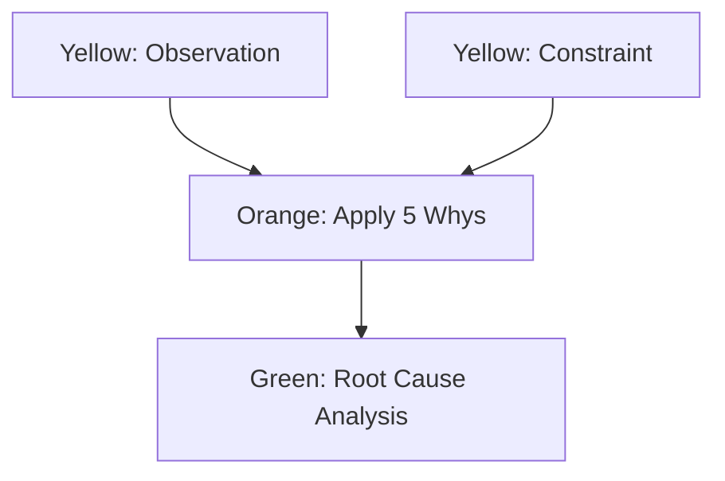
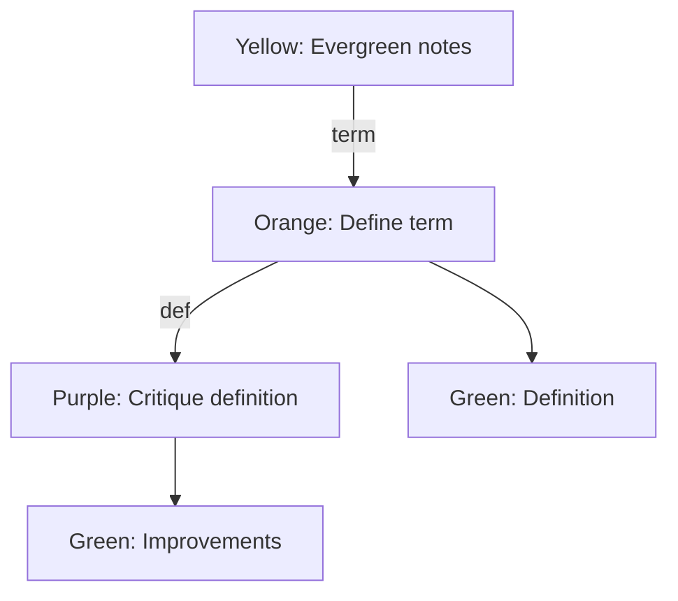
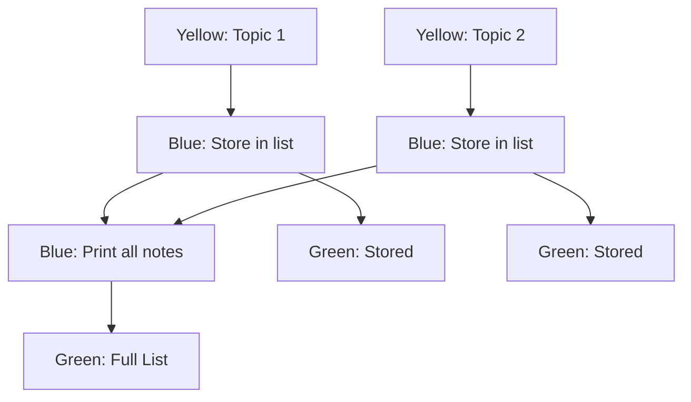

# Zettel Thinking Board 🧠

**A Visual AI Whiteboard for Obsidian.**


Zettel Thinking Board turns your Canvas into an executable flow diagram for python and ollama models. Chain together **Local LLMs** (Ollama) and **Python Scripts** to build complex AI workflows, visualize the results, and refine your thoughts.

## 🌟 The "Zettel" Workflow

Unlike other canvas tools where the output sits *between* nodes, Zettel Thinking Board keeps your logic clean.

*   **The Chain:** Connect your Prompt (Orange) directly to your Code (Blue).
*   **The Result:** When you run a node, a **Green Note** spawns below it (or updates if it already exists), connected by an edge labeled **`output`**. Re-running replaces the green note's content.
*   **The Flow:** Data passes invisibly from parent to child. The Green Note is just for you to read; the Code node reads the raw data directly from the Prompt node. The `output` edge is reserved—Run Node and Run Chain ignore it (green notes are not part of the execution graph).

## 🚀 Features

*   **Color-Coded Intelligence:**
    *   🟧 **Orange:** Primary LLM (e.g., Llama 3).
    *   🟪 **Purple:** Secondary LLM (e.g., Mistral - great for critiquing Orange).
    *   🟦 **Blue:** Python Code (Persistent State).
    *   🟩 **Green:** Auto-generated output (Visual Sidecar).
    *   🟨 **Yellow:** Text (input pass-through). Uncolored or unused-color nodes are not connected and do not add to the prompt.
*   **Persistent Memory:** Variables defined in one Blue node are accessible in connected Blue nodes downstream.
*   **Edge variable injection:** Put a **variable name** on an edge (edit the edge label). In the target note, use `{{var:variableName}}` to inject that parent's output at that spot instead of concatenating it. Edges update after run to show "(injected)" or "(concatenated)". The label **`output`** is reserved for the run node → green output note and is not a variable name; Run Node / Run Chain ignore output edges.
*   **Side Channel Logging:** Send debug info to the side panel console without cluttering your canvas.
*   **Recursive Execution:** "Run Chain" automatically traces back to the start and runs the entire flow to ensure context is fresh.

## 🛠️ Requirements

1.  **Obsidian** (Latest version, desktop app).
2.  **Ollama** running locally.
3.  **Python 3** installed in your system PATH.

## 📦 Installation & Setup

### One-Click Dependency Check

Zettel Thinking Board includes built-in installation helpers to get you started quickly.

1.  Open **Settings → Zettel Thinking Board → Installation & Dependencies**
2.  Use the **Check status** buttons to verify Python and Ollama installations
3.  Click **Install instructions** for platform-specific setup guides
4.  Use **Start service** to launch Ollama if it's installed but not running

### Recommended Models

The plugin recommends three optimized models for different use cases:

#### 🚀 gemma3:4b (3.3 GB) - Fast & Lightweight
*   **Best for:** Text cleaning, formatting, quick processing
*   **Use case:** When you need speed over complexity
*   **Download time:** ~1-2 minutes

#### 💬 gemma3:27b (17 GB) - Conversation Quality
*   **Best for:** Complex conversations, detailed responses
*   **Use case:** When you need nuanced understanding and high-quality output
*   **Download time:** ~5-10 minutes

#### 🧠 deepseek-r1:32b (19 GB) - Logical Reasoning
*   **Best for:** Logical breakdown, complex analysis, structured thinking
*   **Use case:** Multi-step problem solving and analytical tasks
*   **Download time:** ~5-10 minutes

Each model has a **Check** button to verify installation and a **Download** button for one-click installation via `ollama pull`.

### Manual Installation

If you prefer manual setup:

**Python:**
*   macOS: `brew install python3` or download from [python.org](https://www.python.org/downloads/)
*   Windows: Download installer from [python.org](https://www.python.org/downloads/) (check "Add to PATH")
*   Linux: `sudo apt install python3` or your distribution's package manager

**Ollama:**
*   macOS: Download from [ollama.ai](https://ollama.ai/download) or `brew install ollama`
*   Windows: Download installer from [ollama.ai](https://ollama.ai/download)
*   Linux: `curl -fsSL https://ollama.ai/install.sh | sh`

After installing Ollama, start it with `ollama serve` (macOS/Linux) or it will auto-start on Windows.

## 📖 Quick Start

### 1. Setup
1.  **Install dependencies** (see Installation & Setup above)
2.  Open the **Zettel Thinking Board** side panel (Right Ribbon)
3.  Select your models for Orange and Purple inputs
4.  (Optional) Add Environment Variables (e.g., `MY_NAME` = `John`)

### 2. Create a Chain
1.  Add an **Orange Card**: "Write a haiku about rust programming."
2.  Add a **Blue Card** and draw an arrow from **Orange -> Blue**.
3.  In the Blue Card, write:
    ```python
    # 'input' is the string output from the Orange card
    lines = input.split('\n')
    print(f"Haiku has {len(lines)} lines") # Goes to Green Note

    # Send a log to the side panel
    obsidian_log("Analyzing structure...")
    ```

### 3. Run It
*   Right-click the **Blue Card** and select **Run Chain**.
*   **What happens?**
    1.  The Orange card runs. A Green note appears below it with the Haiku.
    2.  The Blue card receives the Haiku text instantly.
    3.  The Blue card runs. A Green note appears below it saying "Haiku has 3 lines".
    4.  "Analyzing structure..." appears in your Side Panel Console.

## 🔗 Edge variable injection

By default, all parent outputs are concatenated and passed to the child. You can instead **inject** a parent's output at a specific place in the child note.

1. **Name the edge:** Select the edge (line) from parent to child and set its **label** to a variable name (e.g. `summary`).
2. **Use the placeholder:** In the child note, write `{{var:summary}}` where you want the parent's output to appear.
3. **Run:** When you run the node or chain, `{{var:summary}}` is replaced by that parent's output, and that parent is **not** concatenated. Other parents (or the same parent if you don't use the variable) are still concatenated as before.
4. **Edge labels after run:** The edge label is updated to `summary (injected)` or `summary (concatenated)` so you can see how each edge was used.

Example: Orange → Purple with edge label `draft`. In the Purple note: "Critique this draft:\n\n{{var:draft}}\n\nBe concise." Only the draft is injected; no extra concatenation.

## 🗂️ Canvas Templates

Create reusable canvas workflows and quickly instantiate them for different projects.

### Setup
1. Open **Settings → Zettel Thinking Board → Canvas Templates**
2. Configure two folders:
   - **Template folder**: Where you store your canvas templates (e.g., `Templates/Canvases`)
   - **Output folder**: Where new canvases from templates will be created (e.g., `Canvases`)

### Commands

**Duplicate canvas template**
- Opens a modal showing all available templates
- Select a template to create a copy in your output folder
- New canvas opens automatically with a unique name

**Save canvas as template**
- Saves the current canvas as a new template
- Creates a copy in your template folder
- Works from any canvas (available only when a canvas is active)

**Edit canvas template**
- Opens a modal showing all available templates
- Select a template to open and edit it directly
- Template banner appears at the top-right to indicate you're editing a template

### Visual Indicator
When viewing a canvas that's in your template folder, a **"📋 Template Canvas"** banner appears in the top-right corner. This helps you know when you're editing a template vs. working with a regular canvas.

### Use Cases
- **Research pipelines** with pre-configured prompt chains
- **Data analysis workflows** with Python nodes and variable injection
- **Content generation templates** with reusable prompt structures
- **Project kickstarters** with standardized node arrangements and colors

## 📚 Tutorial Canvas

Run the command **"Create tutorial canvas"** to generate an interactive tutorial with 3 workflows:

### Workflow 1: Concatenation (Default Behavior)

**What you'll learn:** Multiple inputs automatically combine



**How it works:**
- Both Yellow nodes are **automatically concatenated** (joined with `\n\n`)
- No edge labels needed — this is the default
- Perfect for combining context from multiple sources

---

### Workflow 2: Variable Injection (Precise Placement)

**What you'll learn:** Control exactly where each input appears using `{{var:name}}`



**How it works:**
1. Label the edge: `term` (not `term (concatenated)` — you edit it)
2. In the Orange node: `Define {{var:term}} in one sentence.`
3. When run, `{{var:term}}` is replaced with "Evergreen notes"
4. Without `{{var:name}}`, inputs would concatenate at the top instead

**Use case:** Template-based prompts where you control insertion points

---

### Workflow 3: Python Persistent State

**What you'll learn:** Variables survive across multiple node executions



**How it works:**
- Python kernel stays alive per canvas
- `notes = []` in first Blue node persists for all downstream nodes
- `obsidian_log()` sends debug info to side panel (open via ribbon)

**Use case:** Accumulating data from multiple sources, counting, or stateful transformations

---

## ⚙️ Settings and UX

The plugin settings are organized so that each **model** (primary, secondary, tertiary) is configured in one place:

- **Group by concept:** For each model you set the Ollama model, optional canvas label, and node color in a single collapsible block—no jumping between "Execution" and "Node colors."
- **Progressive disclosure:** The primary model block is expanded by default; secondary and tertiary can stay collapsed. The block summary shows the current choice (e.g. "Primary model — llama2") so you can scan without opening.
- **Execution first, then display:** Settings are ordered as: what runs (models + Python path), then how it looks (colors for Python / Text / Output nodes and the "Show role labels" toggle).
- **One-to-one colors:** Each node type should have a unique color. If you assign a color that another type already uses, an alert reminds you so the canvas stays easy to read.

## ⚙️ Advanced: Python State
The Python kernel stays alive as long as Obsidian is open (or until you click "Restart Kernel").

**Node A (Blue):**
```python
memory = []
```

**Node B (Blue - Connected to A):**
```python
memory.append(input)
obsidian_log(f"Memory size: {len(memory)}")
```
This allows you to build complex data accumulation workflows.

## Behaviour and limitations

*   **Execution graph must be a DAG:** Run Chain and Run entire canvas require the execution graph (arrows between prompts and code, ignoring `output` edges) to have no cycles. If the graph contains a cycle, the plugin reports: *"Execution graph contains a cycle; fix connections and try again."*
*   **Output placement:** Green (output) nodes are placed below the source node with simple collision avoidance. In very dense layouts, the output note may still overlap existing nodes if no free slot is found in the search area.

## Screenshot examples

These example canvases are useful for documentation or marketing screenshots:

1. **Simple chain (quick start)** — One Orange → one Blue → one Green (auto). Orange: "Write a haiku about rust." Blue: e.g. `print(len(input.split()))`. Use for README Quick Start and Run chain.
2. **Edge variable injection** — Orange → (edge label `draft`) → Purple; Purple: "Critique this draft:\n\n{{var:draft}}\n\nBe concise." After run, show edge label with "(injected)". Use for the Edge variable injection section.
3. **Collision avoidance** — Two columns: left column one Orange with Green below; right column another Orange. Run the right Orange and show the new Green placed to the side or below without overlapping. Use for auto-layout / collision behaviour.
4. **Multi-root / branching** — Two roots (e.g. Orange A and Orange B) feeding into one Blue (or two Blues merging). Run entire canvas to show correct topological order from all roots.
5. **Python state (persistent kernel)** — Blue A: `memory = []` → Blue B: `memory.append(input); obsidian_log(str(len(memory)))`. Use for Advanced: Python State and side panel console.
6. **Dismiss output** — Canvas with several Green output nodes; context menu "Dismiss output" and/or toolbar "Dismiss all output" (before/after). Use for README or settings/UX.

## Development

*   **Install:** `npm install` (use `npm install --legacy-peer-deps` if needed for Vitest).
*   **Build:** `npm run build`
*   **Tests:** `npm run test` (unit tests with Vitest). `npm run test:watch` for watch mode.
*   **Deploy to a test vault:** Run `npm run deploy-to-vault` to build and copy `main.js`, `manifest.json`, and `styles.css` into the `zettel-thinking-board/` folder. Copy that folder into your vault at `.obsidian/plugins/zettel-thinking-board/`, then reload the plugin in Obsidian. Alternatively, use the provided `sendToNovelVault.sh` script (edit the path inside it to point at your vault) to build and copy in one step.

## ⚠️ Security Warning
This plugin allows the execution of **arbitrary Python code** on your machine via the Canvas.
*   **Never** run a canvas file you downloaded from an untrusted source.
*   The Python process runs with your user privileges.

## 📄 License
MIT
